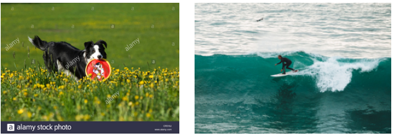

# Semantic Compositional Networks

The Theano code for the CVPR 2017 paper “[Semantic Compositional Networks for Visual Captioning](https://arxiv.org/pdf/1611.08002v2.pdf)”

Model architecture and illustration of semantic composition.


## Dependencies

This code is written in python. To use it you will need:

* Python 2.7 (do not use Python 3.0)
* Theano 0.7 (you can also use the most recent version)
* A recent version of NumPy and SciPy 

## Getting started

We provide the code on how to train SCN for image captioning on the COCO dataset. 

* In order to start, please first download the [ResNet features and tag features](https://drive.google.com/open?id=0B1HR6m3IZSO_QmZVV3hTbmJwRFU) we used in the experiments. Put the  `coco` folder inside the `./data` folder.

* We also provide our [pre-trained model](https://drive.google.com/open?id=0B1HR6m3IZSO_QmZVV3hTbmJwRFU) on COCO. Put the `pretrained_model` folder into the current directory.

* In order to evaluate the model, please download the standard [coco-caption evaluation code](https://github.com/tylin/coco-caption). Copy the folder `pycocoevalcap` into the current directory.

* Now, everything is ready.

## How to use the code

1. Run `SCN_training.py` to start training. On a modern GPU, the model will take one night  to train.

```
THEANO_FLAGS=mode=FAST_RUN,device=gpu,floatX=float32 python SCN_training.py 
```

2. Based on our pre-trained model, run `SCN_decode.py` to generate captions on the COCO small 5k test set. The generated captions are also provided, named `coco_scn_5k_test.txt`.

3. Now, run `SCN_evaluation.py` to evaluate the model. The code will output

```
CIDEr: 1.043, Bleu-4: 0.341, Bleu-3: 0.446, Bleu-2: 0.582, Bleu-1: 0.743, ROUGE_L: 0.550, METEOR: 0.261. 
```

4. In the `./data/coco` folder, we also provide the features for the COCO official validation and test sets. Run `SCN_for_test_server.py` will help you generate captions for the official test set, and prepare the `.json` file for submission. 

## Demo: generating image tags and captions from scratch 

We provide a demo code [here](https://www.dropbox.com/sh/nevmepvedpm5nmz/AACL_Si8hHIljvH5aionIfGKa?dl=0) that detects tags and generates captions from scratch. The code is for research purposes only. The code runs on Windows system and requires Python 3.6.

We provide two running modes. First, generate a caption from a given image url. Second, generate captions for a batch of images. 

1. We can generate a caption from an image url by running `demo_image_captioning.py`. Below are two examples. 

```
python demo_image_captioning.py --image_url http://c8.alamy.com/comp/CR318J/border-collie-playing-with-a-frisbee-in-its-mouth-on-a-meadow-with-CR318J.jpg 
``` 

Outputs:

```
start image captioning @ 12:38:08.430527
first, downloading the image ...
second, extract image features ...
Now, start image captioning ...
Detected tags: grass (1.0), field (0.985), dog (0.977), outdoor (0.94), black (0.919), yellow (0.65), green (0.591), grassy (0.388), small (0.341), standing (0.301),
Generated captions: a black dog with a frisbee in its mouth
end @ 12:38:13.249350
``` 

Another example: 

```
python demo_image_captioning.py --image_url https://coresites-cdn.factorymedia.com/mpora_new/wp-content/uploads/2017/10/Porthleven-Surf-Sep2017-%C2%A9EdBlomfield-100.jpg 
``` 

Outputs:

```
start image captioning @ 12:38:16.257385
first, downloading the image ...
second, extract image features ...
Now, start image captioning ...
Detected tags: water (1.0), sport (0.997), surfing (0.997), wave (0.995), outdoor (0.993), riding (0.978), ocean (0.946), man (0.756), top (0.463), board (0.448),
Generated captions: a man riding a wave on top of a surfboard
end @ 12:38:21.217550
``` 

The two images corresponding to the image urls above are shown below. 



2. We can also generate captions for a batch of images by running `demo_image_captioning_batch.py`.

```
python demo_image_captioning_batch.py 
``` 

Outputs look like the following: 

```
start image captioning @ 21:00:20.145487
First, extract image features ...
Now, start image captioning ...
Image name: COCO_test2014_000000000001.jpg
Detected tags: outdoor (0.999), grass (0.996), truck (0.973), fence (0.97), road (0.872), street (0.515), car (0.494), green (0.466), next (0.438), parked (0.391),
Generated captions: a truck is parked on the side of the road

Image name: COCO_test2014_000000000014.jpg
Detected tags: road (1.0), outdoor (0.994), building (0.973), street (0.927), person (0.811), motorcycle (0.705), man (0.609), sidewalk (0.585), walking (0.443), crossing (0.389),
Generated captions: a man riding a motorcycle down a street

...

end @ 21:00:45.461410
``` 

Generating captions for 10 images roughly takes 25 seconds. 

## Video Captioning

In order to keep things simple, we provide [another separate repo](https://github.com/zhegan27/SCN_for_video_captioning) that reproduces our results on video captioning, using the Youtube2Text dataset.

## Citing SCN

Please cite our CVPR paper in your publications if it helps your research:

    @inproceedings{SCN_CVPR2017,
      Author = {Gan, Zhe and Gan, Chuang and He, Xiaodong and Pu, Yunchen and Tran, Kenneth and Gao, Jianfeng and Carin, Lawrence and Deng, Li},
      Title = {Semantic Compositional Networks for Visual Captioning},
      booktitle={CVPR},
      Year  = {2017}
    }

 